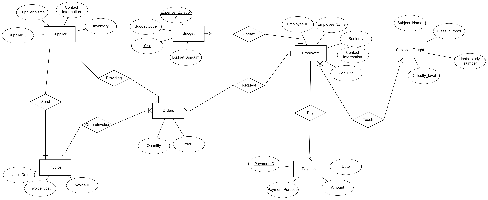

3/6/24

•	Shay Mordechai			315689042

•	Yair Miller			314695438

                                                  School Management System

## Description:

This system is designed to manage a school's administrative operations, including employee information, budgeting, procurement, and financial transactions.

Data Entities:

•	__Employee__ (***Employee_ID***,Employee_Name, Seniority, Contact_Information, Job_Title)

•	__Budget__ (***Budget_Code***, _Employee_ID_, Expense_Category, Budget_Amount, Budget_Year)

•	__Supplier__ (***Supplier_ID***, Supplier_Name, Contact_Information, Inventory)

•	__Invoice__ (***Invoice_ID***, _Supplier_ID_, Invoice_Cost, Invoice_Date)

•	__Orders__ (***Order_ID***, _Supplier_ID_, _Employee_ID_, Invoice_ID, Quantity)

•	__Payment__ (***Payment_ID***, _Employee_ID_, Amount, Payment_Purpose, Payment_Date)


**Relationships:**

• An ***Employee*** may be associated with multiple ***Budgets*** (via Employee_ID in Budget).

• An ***Employee*** can initiate multiple Orders and receive multiple ***Payments*** (via Employee_ID in Orders and Payment).

• A ***Supplier*** can have multiple ***Orders*** placed with them (via Supplier_ID in Orders).

• Each ***Order*** is tied to a single Supplier and a single ***Invoice*** (via Supplier_ID and Order_ID in foreign keys).

• Each ***Invoice*** is linked to a single ***Order*** (via Order_ID in foreign key).

• Each ***Supplier*** must have exactly one Invoice associated with them, and each Invoice must be associated with exactly one ***Supplier***.

**Functionality:**

This database schema allows you to manage various aspects of a school's financial operations:

• Record and manage employee information, including their roles and contact details.

• Define and track budgets allocated to different expense categories, ensuring efficient financial management.

• Maintain supplier details, including their names, contact information, and inventory levels (if applicable).

• Create and manage purchase orders placed with suppliers, tracking details such as order quantities and delivery dates.

• Process invoices received from suppliers for placed orders, ensuring accurate billing and payment reconciliation.

• Record payments made to employees for salaries, bonuses, or grants, enabling efficient payroll processing and financial reporting.

## ERD:
 

The ERD was chosen to accurately represent the key components and relationships involved in the procurement process, employee payroll process, and budget management process.

1. Procurement Process:

Suppliers, Orders, Invoices.

2. Employee Payroll Process:

Employees, Payments, Budget.

3. Management Process:

Budgets, Employees.


## DSD:
 

## Create Tables:
```sql
CREATE TABLE Employee (
   Employee_ID NUMBER(4) PRIMARY KEY,
   Employee_Name VARCHAR(30),
   Seniority NUMBER(5),
   Contact_Information VARCHAR(50),
   Job_Title  VARCHAR(30) CHECK (Job_Title IN ('Budget Committee', 'Procurement Manager', 'Worker'))
);

CREATE TABLE Budget (
   Budget_Code INT PRIMARY KEY,
   Employee_ID NUMBER(4), -- Each budget must be associated with an employee
   Expense_Category VARCHAR(50),
   Budget_Amount DECIMAL(10,2),
   Budget_Year NUMBER(4),
   FOREIGN KEY (Employee_ID) REFERENCES Employee(Employee_ID)
);

CREATE TABLE Supplier (
   Supplier_ID INT PRIMARY KEY,
   Supplier_Name VARCHAR(30),
   Contact_Information VARCHAR(50),
   Inventory DECIMAL(10,2)
);

CREATE TABLE Invoice (
   Invoice_ID INT PRIMARY KEY,
   Supplier_ID INT, -- Each invoice must be associated with a supplier
   Invoice_Cost DECIMAL(10,2),
   Invoice_Date DATE,
   FOREIGN KEY (Supplier_ID) REFERENCES Supplier(Supplier_ID)
);

CREATE TABLE Orders (
   Order_ID INT PRIMARY KEY,
   Supplier_ID INT, -- Each order must be associated with a supplier
   Employee_ID INT, -- Each order must be associated with an employee
   Invoice_ID INT NOT NULL, -- Ensuring Invoice_ID is mandatory
   Quantity INT,
   FOREIGN KEY (Employee_ID) REFERENCES Employee(Employee_ID),
   FOREIGN KEY (Supplier_ID) REFERENCES Supplier(Supplier_ID),
   FOREIGN KEY (Invoice_ID) REFERENCES Invoice(Invoice_ID)
);

CREATE TABLE Payment (
   Payment_ID INT PRIMARY KEY,
   Employee_ID INT, -- Each payment must be associated with an employee
   Amount DECIMAL(10,2),
   Payment_Purpose VARCHAR(20) CHECK (Payment_Purpose IN ('Salary', 'Bonus', 'Grant')),
   Payment_Date DATE,
   FOREIGN KEY (Employee_ID) REFERENCES Employee(Employee_ID)
);
```
## Desc. commands:


## Data Generate – Three Ways:

 
 


 
 
## Text Importer - PLSQL:


 

. 

 

 


## Backup & Recovery


## Queries

The employee with the highest total salary including bonuses.


The employee with the largest number of orders.


Employee and supplier are linked to each other and both have email.


Employees who exceeded the annual budget in the last year by a certain percentage.


Some workers their salary is less than the average.


Increases an employee's inventory under certain conditions.


before


after


Updates a job name for an employee under certain conditions.


before


after


Deletes purchasing managers under certain conditions if they have not made any orders at all.


before


after


Deletes all suppliers who have not issued an invoice over 5 in the last 20 years.


before


after


## ParamsQueries


