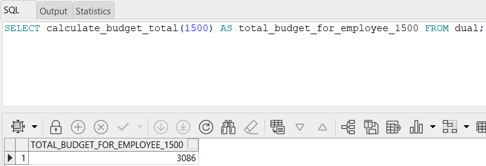
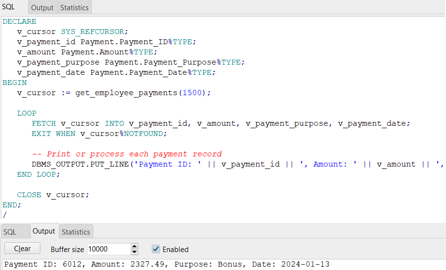
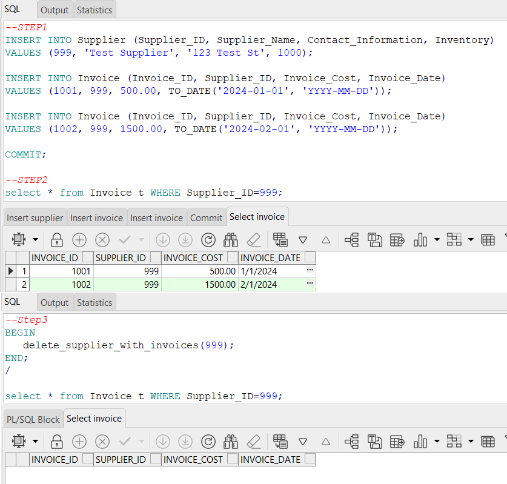
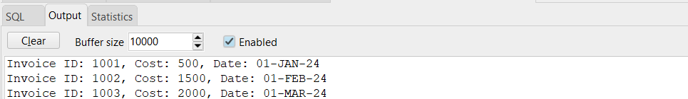

18/6/24

•	Shay Mordechai			315689042

•	Yair Miller			314695438

                                                  School Management System

Stage 3:

## Functions

1. **Budget**
```sql
-- Desc: This script creates a function that calculates the total budget for a given employee.
CREATE OR REPLACE FUNCTION calculate_budget_total(p_employee_id NUMBER)
RETURN DECIMAL
IS
   v_total_budget DECIMAL := 0;
BEGIN
   SELECT SUM(Budget_Amount)
   INTO v_total_budget
   FROM Budget
   WHERE Employee_ID = p_employee_id;

   RETURN v_total_budget;
EXCEPTION
   WHEN NO_DATA_FOUND THEN
      RETURN 0;
   WHEN OTHERS THEN
      RAISE;
END calculate_budget_total;
/
```
*Test the function*
```sql
SELECT calculate_budget_total(1500) AS total_budget_for_employee_1500 FROM dual;
```


2. **Employee**
```sql
-- Desc: This script creates a function that returns a ref cursor containing all payments made to a specific employee.
CREATE OR REPLACE FUNCTION get_employee_payments(p_employee_id NUMBER)
RETURN SYS_REFCURSOR
IS
   v_cursor SYS_REFCURSOR;
BEGIN
   OPEN v_cursor FOR
      SELECT Payment_ID, Amount, Payment_Purpose, Payment_Date
      FROM Payment
      WHERE Employee_ID = p_employee_id;

   RETURN v_cursor;
EXCEPTION
   WHEN OTHERS THEN
      RAISE;
END get_employee_payments;
/
```
*Test the function*
```sql
CREATE OR REPLACE FUNCTION get_employee_payments(p_employee_id NUMBER)
RETURN SYS_REFCURSOR
IS
v_cursor SYS_REFCURSOR;
BEGIN
OPEN v_cursor FOR
SELECT Payment_ID, Amount, Payment_Purpose, Payment_Date
FROM Payment
WHERE Employee_ID = p_employee_id;

RETURN v_cursor;
EXCEPTION
WHEN OTHERS THEN
RAISE;
END get_employee_payments;
/
```


## Procedures
1. **Supplier**
```sql
-- Desc: This script creates a procedure that deletes a supplier and all of its invoices
CREATE OR REPLACE PROCEDURE delete_supplier_with_invoices(p_supplier_id INT)
IS
BEGIN
   DELETE FROM Invoice
   WHERE Supplier_ID = p_supplier_id;

   DELETE FROM Supplier
   WHERE Supplier_ID = p_supplier_id;

   COMMIT;
EXCEPTION
   WHEN OTHERS THEN
      ROLLBACK;
      RAISE;
END delete_supplier_with_invoices;
/
```
*Test the procedure*
```sql
--STEP1: Insert a new supplier and invoices
INSERT INTO Supplier (Supplier_ID, Supplier_Name, Contact_Information, Inventory)
VALUES (999, 'Test Supplier', '123 Test St', 1000);

INSERT INTO Invoice (Invoice_ID, Supplier_ID, Invoice_Cost, Invoice_Date)
VALUES (1001, 999, 500.00, TO_DATE('2024-01-01', 'YYYY-MM-DD'));

INSERT INTO Invoice (Invoice_ID, Supplier_ID, Invoice_Cost, Invoice_Date)
VALUES (1002, 999, 1500.00, TO_DATE('2024-02-01', 'YYYY-MM-DD'));

COMMIT;

--STEP2: Verify the records
select * from Invoice t WHERE Supplier_ID=999;

--STEP3: Call the procedure to delete the supplier and invoices
BEGIN
   delete_supplier_with_invoices(999);
END;
/
```

2. *Budget*
```sql
-- Desc: This script creates a procedure to update the budget amount for a given budget code.
CREATE OR REPLACE PROCEDURE update_budget_amount(p_budget_code INT, p_new_amount DECIMAL)
IS
BEGIN
   UPDATE Budget
   SET Budget_Amount = p_new_amount
   WHERE Budget_Code = p_budget_code;

   COMMIT;
EXCEPTION
   WHEN OTHERS THEN
      ROLLBACK;
      RAISE;
END update_budget_amount;
/
```
*Test the procedure*
```sql
--STEP1: Insert a new record into the Budget table
INSERT INTO Budget (Budget_Code, Employee_ID, Expense_Category, Budget_Amount, Budget_Year)
VALUES (1001, 1500, 'Office Supplies', 500.00, 2024);

COMMIT;
--STEP2: Call the procedure to update the budget amount
BEGIN
   update_budget_amount(1001, 1000.00); -- Update the budget amount to 1000.00 for Budget_Code 1001
END;
/
--STEP3: Verify the update
SELECT Budget_Code, Employee_ID, Expense_Category, Budget_Amount, Budget_Year
FROM Budget
WHERE Budget_Code = 1001;
```


## Programs
1. **Invoice**
```sql
-- Desc: This program generates a report of all invoices for a given supplier.
CREATE OR REPLACE FUNCTION generate_invoice_report(p_supplier_id INT)
RETURN SYS_REFCURSOR
IS
   v_cursor SYS_REFCURSOR;
BEGIN
   OPEN v_cursor FOR
      SELECT Invoice_ID, Invoice_Cost, Invoice_Date
      FROM Invoice
      WHERE Supplier_ID = p_supplier_id;

   RETURN v_cursor;
EXCEPTION
   WHEN OTHERS THEN
      RAISE;
END generate_invoice_report;
/
```
*Test the procedure*
```sql
-- Step 1: Insert Test Data
INSERT INTO Supplier (Supplier_ID, Supplier_Name, Contact_Information, Inventory)
VALUES (1234, 'Test Supplier', '123 Test St', 5000);

INSERT INTO Invoice (Invoice_ID, Supplier_ID, Invoice_Cost, Invoice_Date)
VALUES (1001, 1234, 500.00, TO_DATE('2024-01-01', 'YYYY-MM-DD'));

INSERT INTO Invoice (Invoice_ID, Supplier_ID, Invoice_Cost, Invoice_Date)
VALUES (1002, 1234, 1500.00, TO_DATE('2024-02-01', 'YYYY-MM-DD'));

INSERT INTO Invoice (Invoice_ID, Supplier_ID, Invoice_Cost, Invoice_Date)
VALUES (1003, 1234, 2000.00, TO_DATE('2024-03-01', 'YYYY-MM-DD'));

COMMIT;

-- Step 2: Call the Function and Fetch the Results
DECLARE
   v_invoice_cursor SYS_REFCURSOR;
   v_invoice_id     Invoice.Invoice_ID%TYPE;
   v_invoice_cost   Invoice.Invoice_Cost%TYPE;
   v_invoice_date   Invoice.Invoice_Date%TYPE;
BEGIN
   v_invoice_cursor := generate_invoice_report(1234);

   LOOP
      FETCH v_invoice_cursor INTO v_invoice_id, v_invoice_cost, v_invoice_date;
      EXIT WHEN v_invoice_cursor%NOTFOUND;

      -- Display the results
      DBMS_OUTPUT.PUT_LINE('Invoice ID: ' || v_invoice_id || ', Cost: ' || v_invoice_cost || ', Date: ' || v_invoice_date);
   END LOOP;

   CLOSE v_invoice_cursor;
END;
/
```


2. **Orders**
```sql
-- Desc: This script demonstrates how to create a PL/SQL procedure to process orders.
CREATE OR REPLACE PROCEDURE process_orders
IS
   v_order_id Orders.Order_ID%TYPE;
   v_supplier_id Orders.Supplier_ID%TYPE;
   v_quantity Orders.Quantity%TYPE;
BEGIN
   FOR order_rec IN (SELECT Order_ID, Supplier_ID, Quantity
                     FROM Orders)
   LOOP
      v_order_id := order_rec.Order_ID;
      v_supplier_id := order_rec.Supplier_ID;
      v_quantity := order_rec.Quantity;

      UPDATE Supplier
      SET Inventory = Inventory - v_quantity
      WHERE Supplier_ID = v_supplier_id;

      COMMIT;
   END LOOP;
EXCEPTION
   WHEN OTHERS THEN
      ROLLBACK;
      RAISE;
END process_orders;
/
```
*Test the procedure*
```sql
-- Step 1: Insert Test Data
INSERT INTO Supplier (Supplier_ID, Supplier_Name, Contact_Information, Inventory)
VALUES (5678, 'Test Supplier', '123 Test St', 1000);

INSERT INTO Orders (Order_ID, Supplier_ID, Employee_ID, Invoice_ID, Quantity)
VALUES (2001, 5678, 100, 3001, 100);

INSERT INTO Orders (Order_ID, Supplier_ID, Employee_ID, Invoice_ID, Quantity)
VALUES (2002, 5678, 101, 3002, 200);

COMMIT;

-- Step 2: Call the Procedure
BEGIN
   process_orders;
END;
/

-- Step 3: Verify Results
SELECT Supplier_ID, Supplier_Name, Inventory
FROM Supplier
WHERE Supplier_ID = 5678;
```