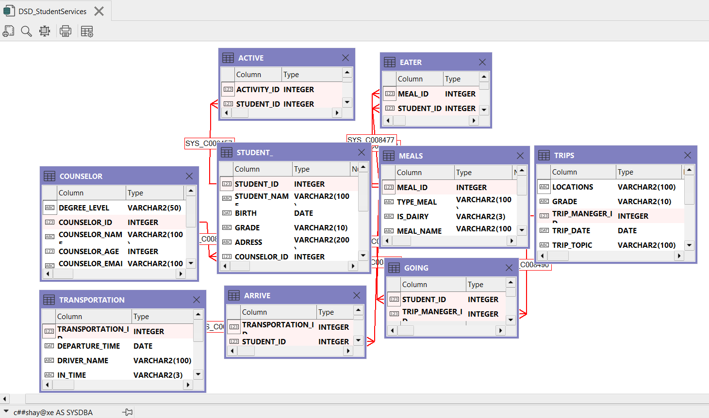
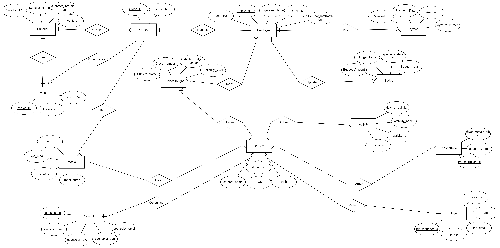

1/7/24

•	Shay Mordechai			315689042

•	Yair Miller			314695438

                                                  School Management System

## Stage 4:

1. **School**

DSD before integration: 

ERD: 


2. **Integrated**


DSD after integration: 

ERD: 


integration decisions:

* 

פקודות sql לביצוע האינטגרציה:


הסבר מילולי של התהליך והפקודות

* .....
```

```


3. **Views**
·         לכל מבט: תיאור מילולי של המבט ושליפת נתונים ממנו עם select * (מספיק 10 רשומות).


1. name_of_view:

explain:

code:

output:

2. name_of_view:

explain:

code:

output:
